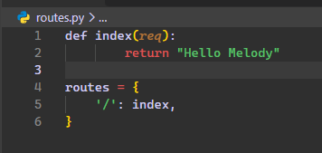
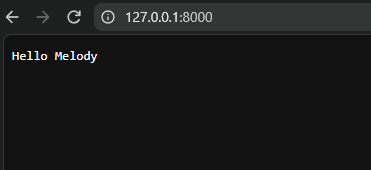

# Melody

Melody is a Python web framework designed to let you build web applications as quickly as possible, with almost no boilerplate.

Melody provides routing, request and response handling, environment variables, a CLI, templates, and a simple database layer out of the box.

## Example

Code: 


Output:


## Features

* Minimal/Almost no boilerplate
* ASGI based application server
* Simple Request and Response classes
* Dynamic routing with slugs
* HTTP method based routing
* Jinja2 template rendering
* Environment variable support
* Built-in CLI
* Development server with `melody run` with hot reload
* Simple ORM built on top of Peewee
* SQLite database support
* Class based database models
* Automatic JSON responses from Python dictionaries
* Werkzeug based routing

## Installation

Install Melody using pip:

```bash
pip install melody-web
```

The Python package itself is imported as `melody`.

## Creating an Application

A basic Melody application can be structured like this:

```text
my-app/
├── routes.py
├── controllers.py
├── models.py
└── templates/
    └── index.html
```

You can keep your controllers in a separate file:

```python
# routes.py

from controllers import index, new

routes = {
    '/': index,
    'POST /new': new
}
```

Or define your controllers directly in `routes.py`:

```python
def index(request):
    return {
        'success': True
    }

routes = {
    '/': index
}
```

## Running the Application

Start your application with:

```bash
melody run
```

By default, Melody runs the application on port `8000`.

You can specify a different port:

```bash
melody run --port 3000
```

This makes it easy to start an application without manually configuring Uvicorn.

## Request and Response

Controllers receive a Melody `Request` object.

A controller can simply return a Python dictionary:

```python
def index(request):
    return {
        'success': True
    }
```

Melody automatically converts the response into the appropriate HTTP response.

You can also explicitly create a `Response`:

```python
from melody.response import Response

def index(request):
    return Response({
        'success': True
    })
```

Responses can also specify status codes, headers, and cookies.

```python
from melody import cookie

def controller(request):
    return Response(
        {'success': True},
        response_type='application/json'
        status=201,
        headers={'id': 'xyz...', ...},
        cookies=[cookie(name='session_id', value='xyz...'), ...]
    )
```

## Routing

Melody uses Werkzeug's routing system internally, allowing dynamic routes and URL parameters.

A simple route:

```python
routes = {
    '/': index
}
```

HTTP methods can be specified directly:

```python
routes = {
    'GET /users': users,
    'POST /users': create_user
}
```

If no HTTP method is specified, the route can match requests regardless of their method:

```python
routes = {
    '/users': users
}
```

### Dynamic Routes

Melody supports dynamic URL parameters:

```python
routes = {
    '/users/<int:id>': user
}
```

The parameter is passed to the controller through the request:

```python
def user(request):
    user_id = request.params['id']

    return {
        'id': user_id
    }
```

Werkzeug's routing syntax allows different types of converters, such as integers and strings.

## Templates

Melody uses Jinja2 as its template engine.

Templates can be rendered using Melody's rendering system:

```python
from melody.render import render

def index(request):
    return render(
        'index.html',
        {
            'name': 'Melody'
        }
    )
```

A template can then use standard Jinja2 syntax:

```html
<h1>Hello {{ name }}</h1>
```

Since Melody uses Jinja2, you can use anything that Jinja2 supports.

## Environment Variables

Melody provides support for reading environment variables, allowing configuration and secrets to be kept outside your source code.

For example:

```env
DATABASE_URL=...
SECRET_KEY=...
```

These values can then be accessed from Python.

This is useful for configuration such as:

* Database credentials
* API keys
* Secret keys
* Application configuration
* Deployment settings

You can use these by
```python
from melody import env

db_url = env('DATABASE_URL')
```

## Database

Melody includes a simple database abstraction built on top of Peewee.

The goal is to provide a simple interface for common database operations without requiring a large amount of configuration.

A basic model can look like:

```python
from melody.db import Database, Table, CharField

db = Database('sqlite3.db')

class User(Table):
    username = CharField()
    email = CharField(unique=True)

db.register([User])
```

You can then use the model with Peewee's familiar query API:

```python
user = User.create(
    username='saksham',
    email='saksham@example.com'
)
```

Querying:

```python
user = User.select().where(
    User.username == 'saksham'
).get()
```


## ORM

Melody's ORM is built completely upon Peewee ORM, thus melody supports everything that peewee supports.

This gives applications access to familiar operations such as:

```python
User.create(...)
User.select()
User.get(...)
User.update(...)
User.delete()
```


## CLI

Melody includes a command line interface for common application tasks.

Start the development server:

```bash
melody run
```

Specify a port:

```bash
melody run --port 8080
```

The CLI is designed to keep application setup and development commands short and simple.

## Application Philosophy

Melody is built around one main idea:

> Build web applications with as little boilerplate as possible.

A typical Melody controller can be as simple as:

```python
def index(request):
    return 'hello melody'
```

Combined with:

```python
routes = {
    '/': index
}
```

and:

```bash
melody run
```

you have a working web application.

## Project Structure

A larger application can be organized like this:

```text
my-app/
├── routes.py
├── controllers.py
├── models.py
├── db.py
├── templates/
│   ├── index.html
│   └── users.html
└── .env
```

Melody does not force a particular project structure, so small applications can remain simple while larger applications can be organized into separate modules.

But all the routes must be defined as routes dictionary in routes.py.

## Why Melody?

I built mellody to minimise the amount of code written to make a fully functional web app.

For example, in a controller, when you return a dictionary, melody automatically returns as JSON, a string as plain text, and when you send down html in a string, it automatically detects it, and renders it as html.

